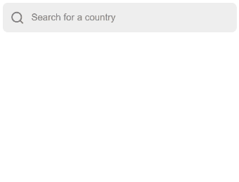

<h3 align="center">
  Autocomplete
</h3>

  Accessible autocomplete component for vanilla JavaScript and Vue 3.

  
  

  

## Demo

Take a look at the [documentation page](https://autocomplete.trevoreyre.com), and the [Codepen examples](https://codepen.io/collection/DrwmoR/).

## Features

- Accessible, with full support for ARIA attributes and keyboard interactions. Based on the [WAI-ARIA Authoring Practices](https://www.w3.org/TR/wai-aria-practices-1.1/#combobox).
- Available as a [JavaScript][javascript-component] or [Vue component][vue-component], with React coming soon. For Vue.js 2.x support please use the latest 2.x release of this package.
- [Core package][core-package] available if you want to bring your own rendering layer.
- Customizable. Easily bring your own CSS, or take full control of the component rendering.
- Support for asynchronous data fetching.

## Packages

Autocomplete is available as a JavaScript component, a Vue component, or a core package. See the docs on an individual package to learn more.

- [JavaScript component][javascript-component]
- [Vue component][vue-component]
- [Core package][core-package]

[version-badge]: https://img.shields.io/npm/v/@trevoreyre/autocomplete.svg?style=flat-square
[package]: https://www.npmjs.com/package/@trevoreyre/autocomplete
[license-badge]: https://img.shields.io/npm/l/@trevoreyre/autocomplete.svg?style=flat-square
[license]: LICENSE
[autocomplete-gif]: docs/autocomplete.gif
[autocomplete-image]: docs/autocomplete.png
[javascript-component]: packages/autocomplete-js
[vue-component]: packages/autocomplete-vue
[core-package]: packages/autocomplete
